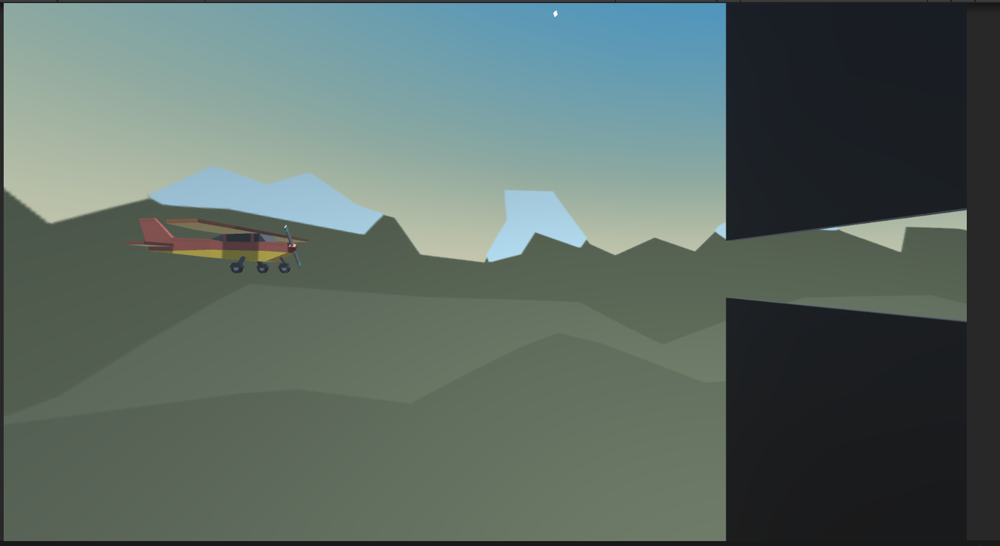

# Hi Legends 👋
# 
Plane Programing

  
* Learn to move and rotate objects around/along the axis.
* Learn to move objects dependent on frame rate.

## 🛠️ Tech Stack
- [Unity3D](https://unity.com/)
- [C#]()

    
    

        
